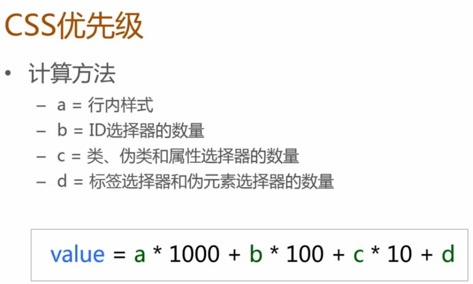

## HTML元素大全
[示例](example/html/标签大全.html)
## HTML语义化
[示例](example/html/HTML5语义化标签.html)
## 页内锚点
```html
<a href="#jump">我跳！</a>
<p>...</p>
<div id="jump">跳到我这里</div>
<!--可用于回到顶部功能-->
<!--标签一般要求写上alt属性-->

<!--总是记不住row表示行，col表示列。表格中tr表示行（table row）
th和td(table data cell)表示列-->
```
## 语义化的好处

    1.SEO搜索引擎优化
    2.提高可访问性
    3.提高代码可读性，便于多人修改维护，提高开发效率

## 实体字符
```html
&nbsp; 空格 
&gt; >
&lt; <
&copy; ©
&amp; &
```
## html5中可以用<video>插入视频，用<audio>标签插入音频
```html
<video src="url" width="200" height="200" controls>不支持时显示</video>
<audio src="url" controls>不支持时显示</audio>
<!--css引入-->
<link rel="stylesheet" href="style.css">
<!--属性选择器-->
<input class="s-left" type="text" disabled value="张山">
<p class="s-right">right</p>
<div class="nav">nav</div>
```

## CSS
```css
[disabled]{}
input[type="text"]{}
[class^="s"]{}

//可以选中class属性以s开头的元素，即input和p
```
## 伪类选择器：一个冒号
### a标签的伪类选择器顺序从上到下不能改变：
```css
    a:link{}
    a:visited{}
    a:hover{}
    a:active{}
    
    ::first-letter{}第一个字母或汉字

    ::first-line{}第一行
    
    ::after和::before
    p::before{content:"before"}//在元素之前添加内容
    p::after{content:"after"}//在元素后添加内容

    ::selection{}应用于被用户选中的样式
```


## 兄弟选择器
```css
     h2+p{}
     //选中h2后面同级的紧邻着的一个p元素
```
## 多个兄弟选择器
```css
 h2~p{}
 //选中h2后面同级的所有p元素，不需要紧邻着
```
## 继承关系：

    继承属性：color font text-align list-style
    非继承属性：background border position

    文档当前属性是否可以继承，看文档中Inherited为yes即为可以继承

## 选择器的优先级

```css
    注：伪类优先级和类相同，伪元素与标签优先级相同

    !important优先级最高：
    p{color:blue !important}
```
## CSS文本
```css
    font属性至少设置font-size和font-family
    
    white-space:
        pre 完完整整的保留tab和空格，超出时也不会自动换行
        pre-wrap 保留tab和空格，超出时自动换行

    word-wrap:break-word;
        长单词超出时自动换行。

    text-shadow:1px 2px blue;
        文字阴影：x轴偏移，y轴偏移 [阴影模糊半径]？[颜色]？

    text-overflow：clip |elipsis;
        配合overflow：hidden;white-space:nowarp;使用
```

## CSS盒模型
```css
    盒模型的概念IE和w3c,width,height,margin(水平居中),bordr,
    border-radius,overflow,box-sizing,box-shadow,outline

    margin合并
    1.相邻元素margin会合并
    2.父元素和子元素的margin会合并(前提是父子元素之间没有padding，
    border和其他元素)
    MDN外边距合并


    border-radius
    border-radius：水平半径，垂直半径


    box-shadow:2px 3px 3px 4px #ccc;
    none： 无阴影 
    <length>①： 第1个长度值用来设置对象的阴影水平偏移值。可以为负值 
    <length>②： 第2个长度值用来设置对象的阴影垂直偏移值。可以为负值 
    <length>③： 如果提供了第3个长度值则用来设置对象的阴影模糊值。不允许负值 
    <length>④： 如果提供了第4个长度值则用来设置对象的阴影外延值。可以为负值 
    <color>： 设置对象的阴影的颜色。
```

## CSS背景
```css
    background-attachment：scroll | local；设置滚动状态时，背景图的状态
    scroll：背景图不动
    local：背景图随内容一起滚动

    background-position：20% 30%；设置百分比的值注意；
    X轴上图片的20%在容器的20%的位置，Y轴上图片的30%在容器的30%的位置

    background-image：url(1.png)

    background-repeat:no-repeat;

    background缩写：position与size之间要加/不然会冲突
    background： url(test1.jpg) no-repeat scroll 10px 20px/110px 130px content-box padding-box #aaa;
```
## CSS布局
```css
    布局简介，display（水平居中，居中导航），position（轮播头图，固定顶栏，遮罩，三行自适应布局）
    float(两列布局)，flex（三行两列自适应）

    position定位，同时设定top和bottom，元素会被撑开变大

    z-index存在一个栈的概念
    红色元素的父元素z-index为9，蓝色元素的父元素z-index为1，所以虽然蓝色元素z-index
    为100大于红色元素z-index的1，但是红色的参照物（父元素）的z-index大，
    所以红色还是在蓝色的上面。形如两副扑克牌，下面的一副无论怎么调整都无法跑到上面

    position：relative；参照物为元素本身，常用于绝对定位元素的参照物

    position：absolute;默认宽度是内容宽度，脱离文档流

    position: fixed; 场景：遮罩（mask）
```
## 清除浮动
    clear属性清除浮动方案：
    1.伪元素
    2.空白标签
    3.overflow：hidden（bfc）


## CSS变形transform
```css
    向下为Y轴正方向，向右为X轴正方向

    transform：translate(20%，20%);移动这里的20%参照物是本元素的宽和高

    transform：skew(30deg);倾斜
    y轴负方向向X轴正方向倾斜，X轴正方向向Y轴负方向倾斜

    transform：rotate（45deg）;旋转

    transform：translate(100px) rotate(45deg);先移动，在旋转
    和transform：rotate(45deg) translate(100px) ;先旋转，再移动
    旋转后X轴与Y轴方向发生了变化

    2D Transform Functions：
    matrix()： 以一个含六值的(a,b,c,d,e,f)变换矩阵的形式指定一个2D变换，相当于直接应用一个[a,b,c,d,e,f]变换矩阵 
    translate()： 指定对象的2D translation（2D平移）。第一个参数对应X轴，第二个参数对应Y轴。如果第二个参数未提供，则默认值为0 
    translatex()： 指定对象X轴（水平方向）的平移 
    translatey()： 指定对象Y轴（垂直方向）的平移 
    rotate()： 指定对象的2D rotation（2D旋转），需先有 <' transform-origin '> 属性的定义 
    scale()： 指定对象的2D scale（2D缩放）。第一个参数对应X轴，第二个参数对应Y轴。如果第二个参数未提供，则默认取第一个参数的值 
    scalex()： 指定对象X轴的（水平方向）缩放 
    scaley()： 指定对象Y轴的（垂直方向）缩放 
    skew()： 指定对象skew transformation（斜切扭曲）。第一个参数对应X轴，第二个参数对应Y轴。如果第二个参数未提供，则默认值为0 
    skewx()： 指定对象X轴的（水平方向）扭曲 
    skewy()： 指定对象Y轴的（垂直方向）扭曲 
    3D Transform Functions：
    matrix3d()： 以一个4x4矩阵的形式指定一个3D变换 
    translate3d()： 指定对象的3D位移。第1个参数对应X轴，第2个参数对应Y轴，第3个参数对应Z轴，参数不允许省略 
    translatez()： 指定对象Z轴的平移 
    rotate3d()： 指定对象的3D旋转角度，其中前3个参数分别表示旋转的方向x,y,z，第4个参数表示旋转的角度，参数不允许省略 
    rotatex()： 指定对象在x轴上的旋转角度 
    rotatey()： 指定对象在y轴上的旋转角度 
    rotatez()： 指定对象在z轴上的旋转角度 
    scale3d()： 指定对象的3D缩放。第1个参数对应X轴，第2个参数对应Y轴，第3个参数对应Z轴，参数不允许省略 
    scalez()： 指定对象的z轴缩放 
    perspective()： 指定透视距离 
```

## CSS动画效果：过渡效果transition ie10+
```css
    <' transition-property '>：
    检索或设置对象中的参与过渡的属性
    <' transition-duration '>：
    检索或设置对象过渡的持续时间
    <' transition-timing-function '>：
    检索或设置对象中过渡的动画类型
    <' transition-delay '>：
    检索或设置对象延迟过渡的时间

    eg:transition:
                    border-color .5s ease-in .1s,
                    background-color .5s ease-in .1s,
                    color .5s ease-in .1s;
    如果需要定义多个过渡属性且不想指定具体是哪些属性过渡，同时其他属性只有一个参数值，据此可以对上面的例子进行缩写：
    eg:
        transition: all .5s ease-in .1s;

    对transition的理解：在元素的CSS里定义transition的方案，
    结合hover等鼠标事件定义的属性，与原属性就形成了过度的效果。    
```

## CSS动画：animation动画 ie10+
```css
    @keyframes 规定动画。 
    animation: 所有动画属性的简写属性，除了 animation-play-state: 属性。  
    animation-name: 规定 @keyframes 动画的名称。 
    animation-duration: 规定动画完成一个周期所花费的秒或毫秒。默认是 0。  
    animation-timing-function: 规定动画的速度曲线。默认是 "ease"。 3 
    animation-delay: 规定动画何时开始。默认是 0。 
    animation-iteration-count: 规定动画被播放的次数。默认是 1。  
    animation-directio:n 规定动画是否在下一周期逆向地播放。默认是 "normal"。  
    animation-play-state: 规定动画是否正在运行或暂停。默认是 "running"。  
    animation-fill-mode: 规定对象动画时间之外的状态。 

    eg:
    @keyframes myfirst
        {
        0%   {background: red; left:0px; top:0px;}
        25%  {background: yellow; left:200px; top:0px;}
        50%  {background: blue; left:200px; top:200px;}
        75%  {background: green; left:0px; top:200px;}
        100% {background: red; left:0px; top:0px;}
        //0%等价于from,100%等价于to
        }
    div
        {
        animation: myfirst 5s linear 2s infinite alternate;
                动画名称 周期时间 速度曲线 何时开始 播放次数 轮流反向播放
        /* Firefox: */
        -moz-animation: myfirst 5s linear 2s infinite alternate;
        /* Safari 和 Chrome: */
        -webkit-animation: myfirst 5s linear 2s infinite alternate;
        /* Opera: */
        -o-animation: myfirst 5s linear 2s infinite alternate;
        }
```
## animation与transition区别
    1.transition需要hover或click或js去触发，而animation是自动运行的
    2.animation可以做多帧动画。


