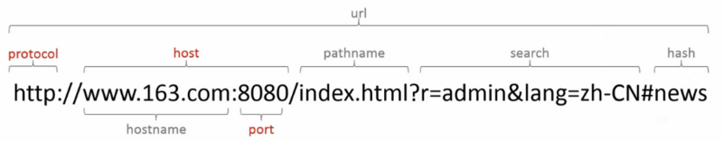
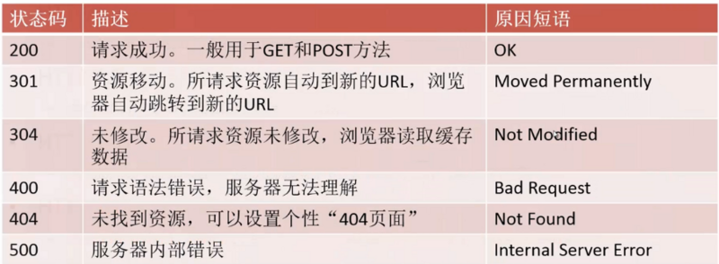

# 数据通信
## 1.HTTP协议
常用http方法：
>>GET: 从服务器取得一份文档
POST：向服务器发送需要处理的数据
PUT: 将请求的主体部分存储在服务器上
DELETE：从服务器上删除一份文档

#### URL构成:


#### 常见HTTP状态码：


## 2.Ajax请求

### 1.打开浏览器
```javascript
var XHttpR=new XMLHttpRequest();
```
### 2.在地址栏输入地址
```javascript
 XHttpR.open('get','1.txt',true);
```
### 2.1[可选]设置请求头
```javascript
XHttpR.setRequestHeader(header,value);
eg:
XHttpR.setRequestHeader("content-type","application/x-www-form-urlencoded");
```
### 3.提交，发送请求
```javascript
XHttpR.send([data=null]);
data可以是string类型,也可以是form-data类型
```
### 4.等待服务器返回内容
```javascript
XHttpR.onreadystatechange=function() {
    if(XHttpR.readyState==4){
        if((XHttpR.status>=200&&XHttpR.status<=300)||XHttpR.status==304){
            console.log(XHttpR.responseText);
        }else{
            console.log('请求成功：'+XHttpR.status);
        }
    } 
}
```
还可以监听XHttpR.onload事件，当XHttpR.readStatus=4并且XHttpR.status=200才会触发

#### 同源策略
两个页面拥有相同的协议（protocol），端口（port），和主机（host）
那么这两个页面就属于同一个源（origin）

#### 跨域资源访问
不满足同源策略的访问，要遵循W3C定义的CORS标准。

# 数据存储
## cookie
document.cookie:是一段小型文本文件，大小在4kb左右。由键值对（name-value）构成
键值对中间由 ;和空格 隔开.
eg:
<div style="color:red font-size:13px;">
"BAIDUID=E7251FF3DAFA752718127CF189026DEF:FG=1; BIDUPSID=
E7251FF3DAFA752718127CF189026DEF; PSTM=1492777383; BDORZ=
B490B5EBF6F3CD402E515D22BCDA1598; PSINO=5; H_PS_PSSID=
22871_1441_19033_21085_22746_20929"
</div>
#### cookie设置：
虽然cookie存储在浏览器端，但大部分cookie是在服务器端进行设置，服务端通过
在http返回的Respond Header里面通过设置Set-Cookie这个字段让浏览器知道需
要存储的cookie。

#### cookie属性：

[MDN的cookie](https://developer.mozilla.org/zh-CN/docs/Web/API/Document/cookie)
* Name 要创建或覆盖的cookie的名字 (string)。
* Value cookie的值 (string)。
* Domain 例如 'example.com'，'.example.com' (包括所有子域名), 'subdomain.example.com')
                如果没有定义，默认为当前文档位置的路径的域名部分。
* Path (例如 '/', '/mydir') 如果没有定义，默认为当前文档位置的路径。
* Expires(时间戳)/Max-Age(最长时间)

#### cookie增删改查：
你可以通过更新一个cookie的过期时间Max-Age为0来删除一个cookie。
[MDN的cookie](https://developer.mozilla.org/zh-CN/docs/Web/API/Document/cookie)

## Web Storage 概念和用法

Web Storage 包含如下两种机制：
    * sessionStorage 为每一个给定的源（given origin）维持一个独立的存储区域，该存储区域在页面会话期间可用（即只要浏览器处于打开状态，包括页面重新加载和恢复）。
    * localStorage 同样的功能，但是在浏览器关闭，然后重新打开后数据仍然存在。

### 对象
* Storage
* StorageEvent

### 属性
* window.sessionStorage
```javascript
// 保存数据到sessionStorage
sessionStorage.setItem('key', 'value');

// 从sessionStorage获取数据
var data = sessionStorage.getItem('key');

// 从sessionStorage删除保存的数据
sessionStorage.removeItem('key');

// 从sessionStorage删除所有保存的数据
sessionStorage.clear();
````
* window.localStorage
>>localStorage 属性允许你访问一个 local Storage 对象。
localStorage 与 sessionStorage 相似。不同之处在于，
存储在 localStorage 里面的数据没有过期时间（expiration time），
而存储在 sessionStorage 里面的数据会在浏览器会话（browsing session）
结束时被清除，即浏览器关闭时。

### 事件
Storage