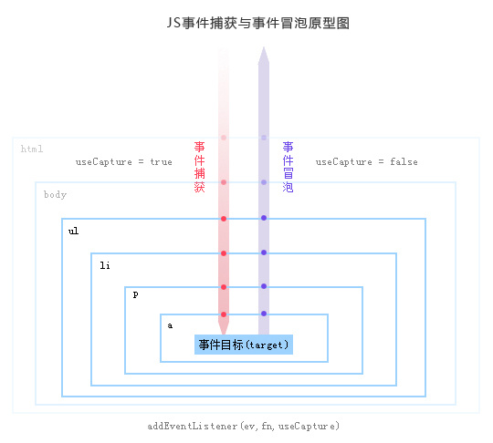
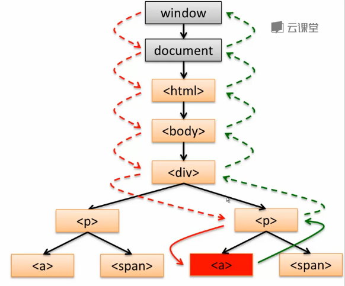
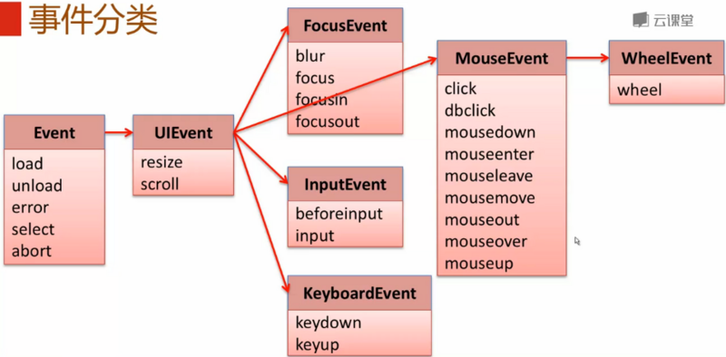
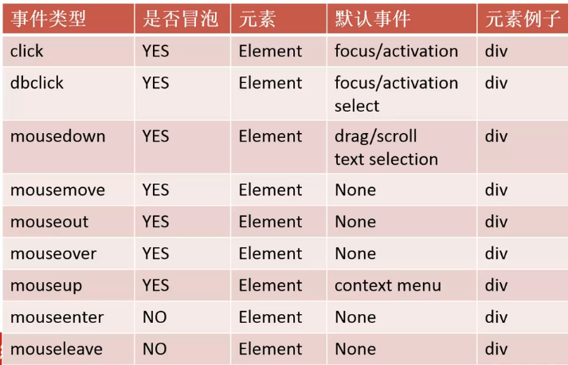
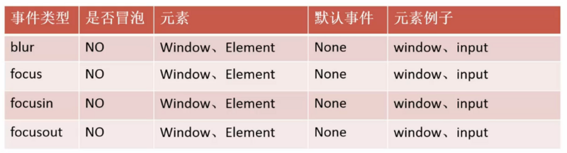
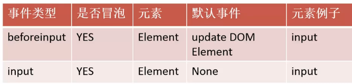
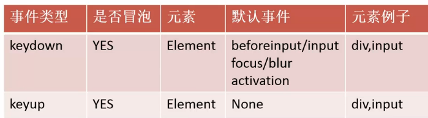

# 文档树DOM
## DOM包含：
* DOM Core
* DOM HTML
* DOM Style
* DOM Event

## 1.节点遍历：
```javascript
node.parentNode
    .firstChild
    .lastChild
    .previousSibling
    .nextSibling
```

## 2.元素节点列行遍历：
```javascript
p.firstElementChild
 .lastElementChild
 .previousElementSibling
 .nextElementSibling
```

## 节点获取

```javascript
//通过id获取
document.getElementById(id);
//通过className，返回live（实时变化）的动态节点集合
document.getElementsByClassName("classA");
//同时获得两个类名的元素节点集合
document.getElementsByClassName("classA classB");
//通过标签名,返回live（实时变化）的动态节点集合
document.getElementsByTagName("p");

//h5的API
document.querySelector("css选择器");//获取第一个符合的元素
//querySelectorAll返回non-live（非实时变化）的动态节点集合
document.querySelectorAll("css选择器");//获取所有匹配元素的集合
```


注：以上选择器(除了getElementById),不仅可以在文档中搜索，而且还可以
在某个元素节点下面查找。eg: document.getElementsByClassName("classA");
element.getElementsByClassName("classA");

## 增加节点

### 创建节点
```javascript
//创建制定名称的节点
element=document.createElement(tagName);
var li=document.createElement("li");
var a=document.createElement("a");
```
### 设置节点内容
```javascript
//获取节点及其后代节点的文本内容或为节点添加内容
element.textContent;
element.innerHTML;
element.textContent="newValue";
element.innerHTML="newValue";
```
### 节点插到文档中
```javascript
//插入节点
//appendChild添加到父元素最后一个子元素后面，也就是结束标签之前
parentElement.appendChild(childElement);

//insertBefore会添加newElement到parentElement下面的referenceElement参考元素前面
parentElement.insertBefore(newChild,refChild);
```

## 移动&克隆节点

### 移动某个节点到某个位置

```javascript
var myElementClone=document.getElementById("myElement");
document.getElementById("new-position").appendChild(myElementClone);
```

### 克隆某个节点到某个位置用：cloneNode(true)

true表示深度复制，把元素及其子元素都复制。false表示浅复制，只复制元素本身
```javascript
var myElementClone=document.getElementById("myElement").cloneNode(true);
document.getElementById("new-position").appendChild(myElementClone);
```

## 删除节点
```javascript
var myChild=document.getElementById("myElement");
parentElement.removeChild(myChild);
//parentElement可以用myChild.parentNode代替
```

## innerHTML的运用
可同时用于添加节点，设置节点内容，插入节点，删除节点
```javascript
//innerHTML 属性设置或返回元素的开始和结束标签之间的 HTML
element.innerHTML
//出于安问题不要用这种方法创建节点，不要用于用户输入的内容
element.innerHTML="<p>嘿嘿嘿</p>";
```

# 属性操作
## 1.HTML attribute->DOM property
input 元素
* id-id
* type-type
* class-className
label元素
* for-htmlFor

## 2.property accessor属性访问器
两种方式：
```javascript
1. input.className;
2. input["id"]='cute';
```
* 属性访问器的通用性和拓展性不好。

## 3.getAttribute/setAttribute
```javascript
1. element.getAttribute(attributeName);
    eg: input.getAttribute("class");
2. element.setAttribute(name,value);
    eg: input.setAttribute("disabled","");//布尔型属性
```
## 4.自定义属性：dataset
HTMLElement.dataset：dataset是HTML元素上的一个属性，是“data-”属性的一个集合
主要是用于元素上保存数据，一般来做自定义的数据属性。
```html
<div id="user" data-id="22" data-account-name="make">make</div>
<p id="info"></p>
```
div.dataset
* id:22
* accountName:make
```javascript
//用js获取
var div=document.getElementById("user");
var data=div.dataset;
//接下来这么搞
var dataId=data.id;
document.getElementById("info").innerText=data.accountName;
```

## 修改class列表：classList

    add( String [, String] )
        添加指定的类值。如果这些类已经存在于元素的属性中，那么它们将被忽略。
    remove( String [,String] )
        删除指定的类值。
    item ( Number )
        按集合中的索引返回类值。
    toggle ( String [, force] )
        当只有一个参数时：切换 class value; 即如果类存在，则删除它并返回false，如果不存在，则添加它并返回true。
        当存在第二个参数时：如果第二个参数的计算结果为true，则添加指定的类值，如果计算结果为false，则删除它
    contains( String )
        检查元素的类属性中是否存在指定的类值。 
```javascript
// div是具有class =“foo bar”的<div>元素的对象引用
div.classList.remove("foo");
div.classList.add("anotherclass");

// 如果visible被设置则删除它，否则添加它
div.classList.toggle("visible");

// 添加/删除 visible，取决于测试条件，i小于10
div.classList.toggle("visible", i < 10);

alert(div.classList.contains("foo"));

//添加或删除多个类
div.classList.add("foo","bar");
div.classList.remove("foo", "bar");
```
## 样式操作

### 1.element.style.cssProperty
```html
<div id="users" style="color: red;"></div>
<script>
var div=document.getElementById("users");
console.log(div.style.color);//red
</script>
```
### 2.更新样式
* element.style.cssProperty
```javascript
element.style.borderColor="red";
element.style.color="blue";
```
* element.style.cssText
```javascript
elemnt.style.cssText="border-color:red;color:blue;";
```
* 更新class
```
.invalid{
border-color: red;
color: red;
}
element.className+= "invalid";
```
* 更换样式表
```html
<link id="skin" rel="stylesheet" href="skin_1.css">

<!--js操作-->
<script >
document.getElementById("skin").href="skin_2.css";
</script>

```
## 获取样式
* element.style.cssProperty

    只能获取写在HTML元素上的样式，style标签和外联css文件无法获取。

# 事件

## 1.事件流
DOM事件流就是DOM事件处理执行的过程。分为三个过程：
* capture phase（捕获过程：从DOM树顶也就是window元素往下捕获，直到触发事件的父元素为止）
* target phase（事件触发过程：在触发事件的节点上进行）
* bubble phase（事件的冒泡过程：从触发事件的节点的父节点开始，冒泡到顶层的Windows对象）
>>事件捕获：当某个元素触发某个事件(如onclick)，顶层对象document就会发出一个事件流，随着DOM树的节点向目标元素节点流去，
            直到到达事件真正发生的目标元素。在这个过程中，事件相应的监听函数是不会被触发的。
  事件目标：当到达目标元素之后，执行目标元素该事件相应的处理函数。如果没有绑定监听函数，那就不执行。
  事件起泡：从目标元素开始，往顶层元素传播。途中如果有节点绑定了相应的事件处理函数，这些函数都会被一次触发。如果想阻止事件起泡，
            可以使用e.stopPropagation()(Firefox)或者e.cancelBubble=true(IE)来组织事件的冒泡传播。
 
原理图：

  
点击a标签：


## 2.事件注册
事件注册，取消与触发的主体都是事件对象的DOM元素。
### 1.事件注册
>> eventTarget.addEventListener(type,listener,[boolean])
>> type:事件类型
>> listener:事件处理函数
>> boolean:是否捕获过程。默认情况是DOM事件处理的是冒泡过程，设置为true时，才会处理捕获过程。

```javascript
var Oelem=document.getElementById("div1");
//定义一个函数来处理事件要干的事
var clickEvent=function(event) {
  //具体功能
}
//注册事件
Oelem.addEventListener("click",clickEvent,false);
```
### 2.取消事件注册
```javascript
eventTarget.removeEventListener("click",clickEvent,false);
```
### 3.事件触发
* 按键触发
* 鼠标触发
* 代码触发：eventTarget.dispatchEvent(type);
>> eg:触发一个click事件：element.dispatchEvent('click');

### 4.事件对象
理解：
>>事件被触发时，会调用事件处理函数，在调用的时候回传给他一些信息，这些信息代表了当前事件的
一些状态，这就叫做事件对象。当事件处理函数在调用的时候，引擎会拿一个对象给我们，
这个对象就是事件对象，这个对象里面有我们可能会用到的一些属性，例如鼠标位置，X ,Y坐标等

```javascript
var element=document.getElementById("div1");
var clickFn=function(event) {//这里的event就是事件对象
//要干的事
}
element.addEventListener('click',clickFn,false);
```
#### 事件对象的属性
* type:事件类型，如click
* target：事件触发的节点，如：点击一个a元素，target就是a元素。
* currentTarget：
>>是我们处理事件节点的元素。由于事件存在冒泡，
所以父元素也可以执行事件，所以就是谁执行事件这个属性就是谁.也就是那个元素。

#### 事件对象的方法
* stopPropagation: 阻止冒泡，阻止事件传递到父节点
* preventDefault: 阻止默认行为
* stopImmediate.Propagate: 阻止冒泡，阻止事件传递到父节点，并且阻止当前节点的后续事件
调用：
* event.stopPropagation();
* event.stopImmediate.Propagation();
* event.preventDefault();

## 事件类型



### 1.Event
使用：img标签，当找不到图片时显示，默认图片onerror事件。
```html

```
### 2.UIEvent
resize: 改变页面或窗体大小时触发的事件
scroll: 滚动事件

### 3.MouseEvent
事件类型：

注意：
>>  mouseout与mouseleave的区别是mouseleave不冒泡
    mouseover与mouseenter的区别是mouseenter不冒泡

MouseEvent事件属性：
* clientX(触发事件的点到页面最左端的距离)，clientY(触发事件的点到最上方的距离)
* screenX(触发事件的点到屏幕最左端的距离)，screenY(触发事件的点到屏幕最上方的距离)

MouseEvent事件顺序：
1. 从元素B上方移过时
>> mousemove -> mouseover(B)->mouseenter(B)->mousemove(B)[很多元素]->
   mouseout(B)->mouseleave(B)

2. 点击元素
>> mousedown -> [mousemove] -> mouseup ->click

eg:[拖拽DIV]()

### 4.FocusEvent
事件类型：

>>blur: 元素失去焦点
focus：元素获得焦点
focusing：元素即将获得焦点时
focusout: 元素将要失去焦点时

属性：
>> relatedTarget:作用：当一个元素失去焦点时，另一个元素就要获得焦点。在blur失去焦点事件中，获得焦点的元素就是这个。
在focus获得焦点事件中，失去焦点的元素就是relatedTarget

### 5.InputEvent事件


### 6.KeyBoardEvent键盘事件

属性：
* key  返回用户按下的键盘物理按键的值
* code 返回用户按下的键盘物理按键

## 事件代理/事件委托

理解：本来自己干的事情给别人干了，这就是事件代理（事件委托）。
可以利用JavaScript的冒泡和捕捉机制和 <span style="background-color:red;">event.target</span> 来实现真正目标的事件实现。

>> 解析:
     为父节点添加一个click事件,当子节点被点击的时候,click事件会从子节点开始向上冒泡.
     父节点捕获到事件之后,通过判断<span style="background-color:red;">e.target.nodeName</span>来判断是否为我们需要处理的节点.
     并且通过e.target拿到了被点击的Li节点.
     从而可以获取到相应的信息,并作处理.


