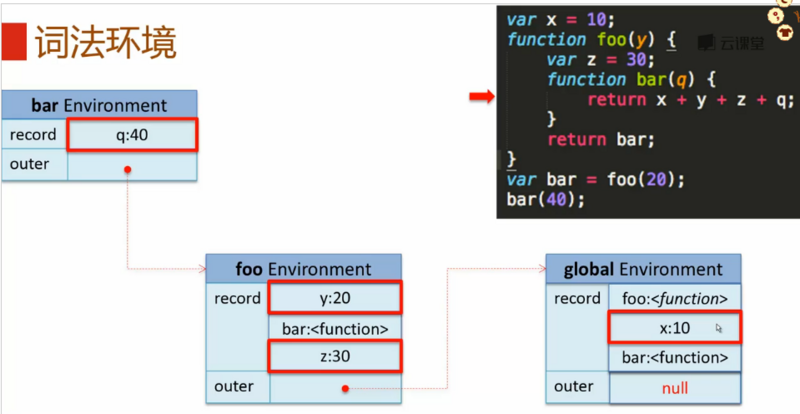

原文参考：https://segmentfault.com/a/1190000009243632
# 基本语法
## 1.严格模式 "use strict"
作用:

* 消除JS语法的一些不合理、不严谨、不安全的问题，减少怪异行为并保证代码运行安全
* 提高编译器解释器效率，增加运行速度

与标准模式的区别：

* 隐式声明或定义变量：严格模式不能通过省略 var 关键字隐式声明变量。会报引用错误“ReferenceError：abc is not define”

* 对象重名的属性：严格模式下对象不允许有重名的属性。var obj = {a:1, b:2, a:3}会报语法错误“SyntaxError”。

* arguments.callee：通常我们使用这个语法来实现匿名函数的递归，但在严格模式下是不允许的。会报错TypeError。

* with语句：严格模式下with语句是被禁用的。会报语法错误 SyntaxError 。

### 2.注释/* */不可嵌套

## 类型系统
### 3.基本类型（标准类型）
主要介绍6种基本类型（Undefine、Null、Boolean、Number、String、Object）、原生类型及引用类型概念


#### 原始数据类型：Undefined、Null、Boolean、String、Number

>>值存于栈内存（stack）中。占据的空间小，大小固定，频繁被使用。

#### 引用数据类型：Object

>>值存于堆内存（heap）中。栈中只保留了一个指针，指向堆中存储位置的起始地址。占据空间大，大小不固定。

### 4.Undefined

#### 出现场景
1. 已声明未赋值的变量
2. 获取对象不存在的属性
3. 无返回值的函数的执行结果
4. 函数的参数没有传入
5. void(expression) 常用于
```html
<a href="javascript:void(0)">
```
#### 向其他数据类型转换
```javascript
Boolean：false
Number：NaN
String："undefined"
```
### 5.Null
#### 出现场景
1. null表示对象不存在 document.getElementById("notExitElement");

#### 向其他数据类型转换
```javascript
Boolean：false
Number：0
String："null"
```

### 6.Boolean : true false
#### 出现场景
1. 条件语句导致系统执行的隐式类型转换 if(document.getElementById("notExitElement");){...}

2. 字面量或变量定义： true, var a = true;
#### 向其他数据类型转换
```javascript
Number：1 0
String："true" "false"
```
#### 出现场景
"abbv" 'lll'

#### 向其他数据类型转换
```javascript
String：  ""    "123"  "notEmpty"
Number：  0      123      NaN
Boolean：false  true     true
```

### 8.Number
#### 出现场景
```javascript
123 var a = 1;
```
#### 向其他数据类型转换
```javascript
Number：  0      123      NaN   Infinity
Boolean：false   true     true    false
String：  "0"   "123"    "NaN"  "Infinity"
```
### 9.Object
一组属性的集合。

#### 出现场景
```javascript
{a: "value-a", b: "value-b", ...}
```
#### 向其他数据类型转换
```javascript
Object:  {}
Number：  NaN 
Boolean： true 
String：  "[object Object]"
```

#### 类型识别

主要介绍typeof、Object.prototype.toString、constructor、instanceof等类型识别的方法。

### 10.typeof
#### 对标准数据类型的识别
```javascript 
typeof 1 // number
typeof true // boolean
typeof "str" // string
typeof undefined // undefined
typeof null // object
typeof {} // object
```

也就是说，标准数据类型中，除了null被识别为object，其余类型都识别正确。

#### 对具体对象的识别
```javascript
typeof function(){} // function
typeof [] // object
typeof new Date(); // object
typeof /\d/; // object
function Person() {};
typeof new Person; // object
```
因此，不能识别具体的对象类型，函数对象除外。

### 11.Object.prototype.toString
```javascript
Object.prototype.toString.call(1); // "[object Number]"
```
所以我们写一个函数来简化调用，以及截取我们需要的部分：
```javascript
function type(obj){
  return Object.prototype.toString.call(obj).slice(8, -1).toLowerCase();
}

type(1) // number
type("str") // string
type(true) // boolean
type(undefined) //undefined
type(null) //null
type({}) //object
type([]) //array
type(new Date) // date
type(/\d/) // regexp
type(function(){}) // function
```
Object.prototype.toString可以准确识别出所有的标准类型以及内置(build-in)对象类型。

```javascript
function Point(x, y){
  this.x = x;
  this.y = y;
}
type(new Point(1, 2)) //object
```
所以它无法识别出自定义类型。

### 12.constructor
对象原型上的一个属性，它指向了构造器本身。

可以识别原始数据类型（undefined和null除外，因为它们没有构造器）,内置对象类型和自定义对象类型，尤其注意自定义对象类型（如：Person）。
```javascript
//判断原始类型
"Jerry".constructor === String //true
(1).constructor === Number //true
true.constructor === Boolean //true
({}).constructor === Object //true
//判断内置对象
[].constructor === Array //true
//判断自定义对象
function Person(name){
  this.name = name;
}
new Person("Jerry").constructor === Person // true !!!
```
### 13.instanceof
```javascript
//判断原始类型
1 instanceof Number // false
true instanceof boolean // false
//判断内置对象类型
[] instanceof Array // true
/\b/ instanceof RegExp // true
//判断自定义对象类型
function Person(name){
  this.name = name;
}
new Person("miao") instanceof Person // true
```
不能判断原始类型，可以判断内置对象类型，可以判断自定义对象类型及父子类型。

## 内置对象


分为两类：普通对象与构造器对象。其中，构造器对象可用于实例化普通对象。

普通对象只有自身的属性和方法。构造器对象除了自身的属性和方法之外，还有原型对象prototype上的属性和方法，以及实例化出来的对象的属性和方法。

以下代码创建了一个Point构造器并实例化了一个p对象
```javascript
function Point(x, y){
    this.x = x;
    this.y = y;
}
Point.prototype.move = function(x, y){
    this.x += x;
    this.y += y;
}
var p = new Point(1,1);
p.move(1,2);
```
#### 普通对象p的原型链：

__proto__"就是我们通常说的原型链属性，他有如下几个特点：
```
1. "__proto__"是对象的一个内部隐藏属性。

2. "__proto__"是对实例化该对象的构造器的prototype对象的一个引用，因此可以访问prototype的所有属性和方法。

3.除了Object对象，每个对象都有一个"__proto__"属性，"__proto__"逐级增长形成一个链就是我们所说的原型链，原型链顶端是一个Object对象。

4.当开发者调用对象属性或方法时(比如"p.move(1,2)")，引擎首先会查找p对象的自身属性，如果自身属性中没有"move"方法，则会继续沿原型链逐级向上查找，直到找到该方法并调用。

5."__proto__"跟浏览器引擎实现相关，不同的引擎中名字和实现不尽相同(chrome、firefox中名称是"__proto__"，并且可以被访问到，IE中无法访问)。基于代码兼容性、可读性等方面的考虑，不建议开发者显式访问"__proto__"属性或通过"__proto__"更改原型链上的属性和方法，可以通过更改构造器prototype对象来更改对象的__proto__属性。
```
#### 构造器对象的原型链：


#### Point.prototype其实就是个普通对象：
```javascript
Point.prototype = {
  move: function(){ ... },
  constructor: function(){ ... }
}
```

#### 构造器对象相对于普通对象有如下几个特点：
```
1. 构造器对象原型链上倒数第二个__proto__是一个Function.prototype对象引用,因此可以调用Function.prototype的属性和方法。

2.构造器对象本身有一个prototype属性，有这个属性就表明该对象可以用来生成其他对象：用该构造器实例化对象时该prototype会被实例对象的
__proto__所引用，即添加到实例对象的原型链上。

3.构造器对象本身是一个function对象，因此会有name,length等自身属性。
```

### 14.Object对象

    String/Number/Boolean/Array/Date/Error构造器都是Object子类对象。

    自身的属性、方法：prototype，create，keys

    原型对象prototype的属性和方法：constructor，toString，valueOf，hasOwnProperty

    因为生成的实例对象只有原型链属性__proto__，没有其他的属性，所以没有实例对象的属性，方法。相对于Array，它就有实例对象属性length。

#### 几个重要方法：

Object.create(proto) ： 基于原型对象创建新对象，传入的是一个对象，会被作为创建出的对象的__proto__属性值。

Object.prototype.toString ：获取方法调用者的标准类型
```javascript
var obj = {a: 1};
obj.toString(); // "[object Object]"
```

Object.prototype.hasOwnProperty ：判断一个属性是否是对象自身属性，还是原型上的属性。
```javascript
var obj = Object.create({a:1});
obj.b = 2;
obj.hasOwnProperty('a'); //false
obj.hasOwnProperty('b'); //true
```

### 15.String, Number, Boolean
#### String

构造器对象属性、方法：prototype， fromCharCode

原型对象属性、方法：constructor，indexOf，replace，slice，charCodeAt，toLowerCase

#### 几个重要方法：

1.String.prototype.indexOf：获取子字符串在字符串中位置索引（一次只查找一个）
```javascript
语法：strObj.indexOf(searchvalue,fromindex)

var str = "abcdabcd";
var idx = str.indexOf("b"); // 1
var idx2 = str.indexOf("b", idx+1); //5
```

2.String.prototype.replace：查找字符串替换成目标字符（一次只替换一个）
```javascript
语法：strObj.replace(regexp/searchvalue, newSubStr/function)

var str = "1 plus 1 equal 3";
str = str.replace("1","2"); // "2 plus 1 equal 3"
str = str.replace(/\d+/g, "$& dollar"); //"2 dollar plus 1 dollar equal 3 dollar"
第二个参数是newSubStr时，其中

$& 代表插入当前匹配的子串
$` 代表插入当前匹配的子串左边的内容
$' 代表插入当前匹配的子串右边的内容
$n 是当第一个参数为regexp对象，且n为小于100的非负整数时，插入regexp第n个括号匹配到的字符串
第二个参数是function时，函数的返回值为替换的字符串，注意如果第一个参数为regexp且为全局匹配，那么每次匹配都会调用这个函数。函数参数：

match：匹配的子串，相当于 $&
p1,p2,...: 如果第一个参数为regexp，对应第n个括号匹配到的字符串，相当于$1,$2
offset: 匹配到的字符串到原字符串中的偏移量，比如 bc 相对于 abcd ，offset 为1
string: 被匹配的原字符串
//精确的参数个数取决于第一个参数是否为regexp，以及有多少个括号分组
```
3.String.prototype.split：按分割符将字符串分割成字符串数组
```javascript
语法：strObj.split(separator, howmany)

var str = "1 plus 1 equal 3";
str.split(" "); // ["1", "plus", "1", "equal", "3"]
str.split(" ", 3); // ["1", "plus", "1"]
str.split(/\d+/); //["", " plus ", " equal ", ""]
```
Number
```javascript
Number.prototype.toFixed

var a = 1.234
a.toFixed(2);//1.23
```
### 16.Array

构造器对象（自身）属性、方法：prototype，isArray

原型对象属性、方法：constructor，splice，forEach，find，concat，pop，push，reverse，shift，slice

实例对象属性、方法：length

#### 几个常用对象方法：
```javascript
1.Array.prototype.splice：从数组中添加、删除或替换元素，并返回被删除的元素列表。会更改原数组。

arr.splice(start, deleteCount[, item1, item2,...])

2.Array.prototype.forEach：遍历数组元素并调用回调函数

语法：arr.forEach(callback*[,thisArg]*) 
function callback(value, index, arrayObject){ ... }

var arr = ["a", ,"b"];
arr.forEach(function(value, index, array){ console.log(value);}) 
//"a" 
//"b"
//空元素被跳过去了哦 
``` 
### 17.Function

自身属性，方法：prototype

原型对象属性，方法：constructor，apply，call，bind

实例对象属性，方法：length，prototype ，arguments，caller

#### 几个常用对象方法：
```javascript
1.Function.prototype.apply：通过传入参数指定 函数调用者 和 函数参数（一个数组或类数组对象） 并执行该函数。
语法：funcObj.apply(thisArg[, argsArray])

thisArg : 函数运行时指定的this值
argsArray : 一个数组或类数组对象

栗子：

(1) Object.prototype.toString.apply("123");// "[object String]"

(2) 使用apply可以允许你在本来需要遍历数组变量的任务中使用內建的函数，比如获得一个数组中最大的值：

var arr = [2, 3, 7, 1];
Math.max.apply(null, arr);// 7 
//这等价于 Math.max(arr[0], arr[1], arr[2], arr[3])
(3) 还可以用于 使用任意一个对象（可以不是当前自定义对象的实例对象）去调用自定义对象中定义的方法

function Point(x, y) {
  this.x = x;
  this.y = y;
}
Point.prototype.move = function(x1, y1) {
  this.x += x1;
  this.y += y1;
} 
var p = new Point(0,0); //p是一个点
p.move(2,2); // p这个点的位置在x轴右移了2，y轴右移了2
//等价于
p.move.apply(p, [2,2]);

//现在我们有一个圆，原点位于(1,1)，半径r=1
var c = {x: 1, y: 1, r: 1}
//要求x轴右移2，y轴右移1
p.move.apply(c, [2,1]);
2.Function.prototype.bind：通过传入参数指定 函数调用者 和 函数参数（一个列表） 并返回该函数的引用而并不调用。
语法：funcObj.bind(thisArg[, argsArray])

thisArg : 函数运行时指定的this值
argsArray : 一个列表

栗子：

（1）绑定函数调用的this值，避免错误的使用了将this指向全局作用域

this.x = 9; 
var module = {
  x: 81,
  getX: function() { return this.x; }
};

module.getX(); // 返回 81

var retrieveX = module.getX;
retrieveX(); // 返回 9, 在这种情况下，"this"指向全局作用域

// 创建一个新函数，将"this"绑定到module对象
// 新手可能会被全局的x变量和module里的属性x所迷惑
var boundGetX = module.getX.bind(module);
boundGetX(); // 返回 81
（2）返回函数的引用而并不调用的另一个好处是：可以指定函数执行的时间。比如有的需求是，在过了一段时间后执行这个函数。

还是上面Point的例子，要求在1000ms以后移动圆：

var c = {x: 1, y: 1, r: 1}
//要求x轴右移2，y轴右移1
var circlemove = p.move.bind(c, 2, 1);
setTimeout(circlemove, 1000);
```
### 子类构造器

上面例子中，调用其他对象的方法也可以通过继承的方法实现：
```javascript
function Circle(x, y ,r) {
  Point.apply(this, [x, y]);
  this.radius = r;
}
//将Circle的原型对象指定为Point的实例对象，这样Circle.prototype上就有了move(x,y)方法
Circle.prototype = Object.create(Point.prototype);
//此时Circle.prototype.constructor属性还等于function Point(x,y)，所以要手动改成function Circle(x,y,r)
Circle.prototype.constructor = Circle;
//还可以定义一些其他的方法
Circle.prototype.area = function () {
  return Math.PI*this.radius*this.radius;
}
var c = new Circle(1,2,3);
c.move(2,2);//调用的是自己原型上从Point继承过来的方法
c.area();
```

构造器对象Circle的原型链：


实例对象c的原型链：


function作为普通函数，有3种调用方式：() , apply , call
函数参数的三个特点：

1. 形参个数不一定等于实参个数

2. 所有参数传递都是值传递，也就是说，参数传递都只是在栈内存中的操作。所以要特别小心引用类型的参数传递，可能会改变传进来的实参的值。

3. 通过参数类型检查实现函数重载


### 18.RegExp、Date、Error
#### RegExp
构造方法：

/pattern/flags
new RegExp(pattarn[, flags]);
原型对象属性、方法：test， exec

test：使用正则表达式对字符串进行测试，并返回测试结果
```javascript
语法：regObj.test(str)

var reg = /^abc/i;
reg.test('Abc123'); //true
reg.test('bc123');//false
```
#### Date
```javascript
var myDate = new Date();
var myDate = new Date(2017,3,1,7,1,1,100);
var h = myDate.getHours();
var m = myDate.getMinutes();
var s = myDate.getSeconds();
```

### 19.标准内置对象中的非构造器对象之——Math，Json

Math对象是拥有一些属性和对象的单一对象，主要用于数字计算

常用方法：
```javascript
Math.floor(num) ：向下取整

Math.ceil(num)向上取整
```
#### JSON对象主要用于存储和传递文本信息

常用方法：
```javascript
JSON.parse(jsonStr)：将JSON字符串解析为JSON对象

JSON.stringify(jsonObj)：将JSON对象序列化为JSON字符串
```

### 20.标准内置对象中的非构造器对象之——全局对象

属性：NaN，Infinity，undefined

方法：parseInt，parseFloat，isNaN，isFinite，eval

处理URI的方法：encodeURIComponent，decodeURIComponent，encodeURI，decodeURI

构造器属性：Boolean，String，Number，Object，Function，Array，Date，Error...

对象属性：Math，JSON
```javascript
（1）NaN不等于任何值，包括它自己本身。

（2）parseInt(string[, radix]) 用于将字符串转换为数字，参数：要转换的字符串，进制（默认十进制）

parseInt('1'); //1 * 10^0 = 1
parseInt('1', 16); //1 * 16^0 = 1
parseInt('1f'); // 1 * 10^0 = 1
parseInt('1f'); //1 * 16^1 + f * 16^0 = 16 + 15 = 31
parseInt('f1'); // NaN
（3）eval计算某个字符串，并执行其中的Javascript代码。

语法：eval(string)

不建议使用，会有性能问题。

（4）encodeURIComponent：用于将URI参数中的中文、特殊字符等作为URI的一部分进行编码

语法：encodeURIComponent(URIString)
```
#### 栗子： 
```javascript
1.防止注入性攻击：
var url = "http://www.xxx.com/index.html?name=" + encodeURIComponent(name);
2.依赖URL进行参数传递时，对于参数中有特殊字符（如"&"，"/"）的要对其进行编码：
var url = "http://www.xxx.com/index.html?name=" + encodeURIComponent("Tom&Jerry") + "&src=" + encodeURIConponent("/assert/image/test.png");
```

## 表达式与运算符
介绍表达式、算术运算符、位运算符、布尔运算符、关系运算符、相等与全等、条件运算符。

### 21.表达式
JS短语，解释器可以执行它并生成一个值。

### 22.运算符

```javascript
=== ：类型相同且值相等
var a = "123";
var oa = new String("123");

a === oa; // false 其中 a 为string值类型，oa为object对象类型
== ：判断操作符两边对象或值是否相等
规则用伪代码表示为：

function equal(a, b) {
  if a、b类型相同
    return a === b;
  else a、b类型不同
    return Number(a) === Number(b);
}

"99" == 99 //true
"abc" == new String("abc") // true

例外：
1.null == undefined //true
2.null与undefined进行 == 运算时不进行类型转换
  0 == null //false
  null == false // false
  "undefined" == undefined // false
```
#### !!x 表示取x表达式运行后的Boolean值
#### 注意&& 和 || 都有短路功能
#### 运算符优先级： * / % 高于 + - 高于 && || 高于 ? :
完整表格：


## JS语句

#### 条件控制语句

#### 循环控制语句
```javascript
for in ：遍历对象的属性

function Car(id, type, color) {
  this.id = id;
  this.type = type;
  this.color = color;
} 
var benz = Car(12345, "benz", "black");
for(var key in benz) {
  console.log(key + ": " + benz[key]);
}
//id: 12345
//type: benz
//color:black
//当这个对象有函数时遍历就会把原型对象上的方法也遍历出来

Car.prototype.start = function() {
  console.log(this.type + "start");
}
//遍历的时候会多一项
//start: function(){ ... }
//但我们通常是不需要方法的，而方法通常都是存在于原型对象上，所以可以通过hasOwnProperty判断是否为对象本身属性：
for(var key in benz) {
  if(benz.hasOwnProperty(key)) {
    console.log(key + ":" + benz[key]);
  }
}
```
#### 异常处理语句
```javascript
try catch finally throw
```
#### with语句

通过暂时改变变量的作用域链(将with语句中的对象添加到作用域链的头部)，来减少代码量。
```javascript
(function(){
  var a = Math.cos(3 * Math.PI) + Math.sin(Math.LN10);
});

//用with语句

(function(){
  with(Math){
    var a = cos(3 * PI) + sin(LN10);
  }
})
```
原型链如图：


## 变量作用域
### 主要关注两个方面：

1. 变量的生命周期和作用范围。
2. 看到一个变量时，要能找到变量定义的位置。

#### 变量作用域分为静态作用域和动态作用域：
* 静态作用域（词法作用域）：在编译阶段就可以决定变量的引用，只跟程序定义的原始位置有关，与代码执行顺序无关。

* 动态作用域：在运行时才能决定变量的引用。一步一步执行代码，把执行到的变量和函数定义从下到上依次放到栈里面，用的时候选离自己最近的一个（比如有两个x的定义，选离自己最近的一个）。

JS使用静态作用域。ES5使用词法环境管理静态作用域。

### 词法环境
* 是什么？

    是用来描述和管理静态作用域的一种数据结构。

* 组成？
1. 环境记录（record）[形参、变量、函数等]
2. 对外部词法环境的引用（outer）

* 什么时候创建？

一段代码在执行之前，会先初始化创建一个词法环境。又因为JS没有块级作用域，只有全局作用域和函数作用域，所以在JS中只有全局代码或者函数代码开始执行前会先初始化词法环境。

* 哪些东西会被初始化到词法作用域中呢？

1. 形参（一定要是这个函数显式定义的形参，而不是真实传进来的参数，即不是实参）

2. 函数定义（除了这个函数的形参和函数体，需要特别注意：在初始化的时候会保存当前的作用域到函数对象中,即 scope:currentEnvironment）这也是形成闭包的必要条件呀！
3. 变量定义（var a = xxx;）

* 词法环境是怎样构成的？



知道了词法环境的构成，就可以分析代码是如何执行的，知道里面的变量到底引用的是什么值。

#### 几个关于词法环境的问题

1. 形参、函数定义或变量定义名称冲突时，优先级：函数定义 > 形参 > 变量定义

2. arguments这个对象其实也是在环境记录中的

3. 函数表达式是在执行到函数表达式这一句代码时才创建函数对象，而函数定义是在代码初始化时就创建了函数对象，保存了当前作用域。

词法环境可能发生变化的栗子
#### with
```javascript
var foo = "abc";
with({ foo: "bar" }) {
  function f() { alert foo; }
  (function() { alert foo; })(); //这就是一个函数表达式，只有在执行到这一句时才会创建函数对象
  f();
}
```

#### 注意函数定义与函数表达式的区别：
```javascript
因为词法环境只会记录【形参，函数定义，变量定义】这三项。
而且JS中只有全局作用域和函数作用域，没有块级作用域，所以所有不在函数作用域中定义的变量或者函数都是属于全局作用域的。
而with会创建一个临时的作用域，叫with的词法环境，在with中用var定义一个变量与在with外一样，都是在代码初始化时就被放到词法环境中，而函数表达式则是在执行到那一句代码时再放进词法环境中。
所以函数定义f()的词法环境outer指向global，而函数表达式词法环境的outer指向with。
注意：这里仅仅拿with举例，我们不建议使用with，容易造成混淆。
```
#### try-catch

catch的代码块与with的代码块很相似，也是临时创建的词法环境。


左侧的 closure Environment 即为右边红框圈出来的函数表达式的词法环境，outer指向catch Environment。

#### 带名称的函数表达式（不常用）
```javascript
(function A(){
  A = 1;
  alert(A);
})();

因为A是一个函数表达式，并不是一个函数定义，所以A不会定义到global Environment中。
然后执行到这一句时，与之前的匿名函数表达式类似，创建一个该函数表达式的词法环境，把A这个函数表达式定义到这个词法环境中。而且在A的环境里定义的A函数不能被修改，所以A = 1是没有用的，仍然会alert出 function A(){A=1;console.log(A);}。
```


### 函数体内部声明的函数，作用域绑定函数体内部
```javascript
function foo() {
  var x = 1;
  function bar() {
    console.log(x);
  }
  return bar;
}

var x = 2;
var f = foo();
f() // 1
上面代码中，函数foo内部声明了一个函数bar，bar的作用域绑定foo。当我们在foo外部取出bar执行时，变量x指向的是foo内部的x，而不是foo外部的x。正是这种机制，构成了下文要讲解的“闭包”现象。
```
>> 来自阮一峰的文章

### 函数定义和函数表达式区分

>>函数定义与函数表达式基本是一样滴
因为那些在等号右边的只能是表达式，所以它们是函数表达式
虽然，函数表达式一般情况下没有名字，但是呢，它们也是可以有名字滴，有名字之后就与函数声明的语法真的一样了

阮大大博客里讲函数的一篇

>>为了避免解析上的歧义，JavaScript引擎规定，如果function关键字出现在行首，一律解释成语句。因此，JavaScript引擎看到行首是function关键字之后，认为这一段都是函数的定义。
所以这样句首不是function的(function(){})();就是函数表达式

## 闭包

### 什么是闭包？
闭包是由函数和它引用的外部词法环境组合而成。

闭包允许函数访问其引用的外部词法环境中的变量（又称自由变量）。
```javascript
看个栗子：下面的函数add()最终return的值是一个函数，且在add函数外调用return出来的这个匿名函数时可以引用add函数内部的环境，使用add函数内部定义的变量i。

function add(){
  var i = 0;
  return function() {
    console.log(i++);
  }
}

var f = add();
f(); // 0
f(); // 1
```
一般来说，一个函数执行完之后，内部的局部变量都会被释放掉，就不存在了。但是JS比较特殊，因为JS中允许函数作为返回值，当函数作为返回值，这个函数就保存了对外部词法环境的引用，而相应的，外部词法环境中定义的变量就不会被释放掉，会一直保留在内存中。这就是JS的闭包。闭包使得它引用的函数的内部环境一直存在，所以闭包可以看作是它引用的函数的内部环境的一个接口。

广义上来说，所有的JS函数都可以称为闭包，因为所有的JS函数创建后都保存了当前的词法环境。

### 闭包的应用

闭包最大的作用有两个:
* 一个是可以读取函数内部的变量，
* 另一个是使这些变量始终保存在内存中。

### 1.使外部词法环境的变量始终保存在内存中
```javascript
function createIncrementor(start) {
  return function () {
    return start++;
  };
}

var inc = createIncrementor(5);

inc() // 5
inc() // 6
inc() // 7
start 存在于 createIncrementor 的词法环境中，通过闭包inc被保留在内存中，因此可以累加。
```
### 2.保存变量现场
需求：为一组元素注册onclick事件，当点击其中某一个元素触发onclick事件时能将该元素的索引打印出来。
```javascript
看下面这段代码是否可以实现？

var addHandlers = function(nodes) {
  for(var i=0; i<nodes.length; i++){
    nodes[i].onclick = function(){
      alert(i);
    }
  }
} 
```
试过会发现：每次弹出的都是3，所以这样写是不能实现的。因为JS没有块级作用域，所以每次for循环不会形成单独的作用域，因此最内层的匿名function函数中所有的i共享它的外部词法环境addHandler函数中的同一个变量i。而当onclick被调用时，循环早已结束，所以i的值也就是循环结束后的nodes.length。

如果你不幸跟我一样智商不高，那么就把for循环拆开看看吧：
```javascript
var addHandler = function(nodes){
  var i = 0;
  nodes[i].onclick = function(){
    alert(i); 
  }
  //等价于
  //nodes[0].onclick = function(){
  //  alert(i); 注意这里还是i，当onclick被调用，循环已经结束了，也就是addHandler函数执行到最后了，所以i是3
  //}
  i = 1;
  nodes[i].onclick = function(){
    alert(i);
  }
  i = 2;
  nodes[i].onclick = function(){
    alert(i);
  }
  i = 3;
}
addHandler(document.getElementsByTagName('a'));
这样总可以理解了吧。
```
#### 如何改进？

既然问题出在每一次for循环没有能够形成单独的作用域来保存每一次for循环的变量i的值，那么要解决的就是这个问题。
方法就是用刚刚学的闭包：在内层匿名函数外面与for循环之间加一个帮助函数helper，helper有一个形参i，在每一次for循环时，都调用一次helper(i)，传入本次循环的i，helper接收了这个形参之后，把它存到自己的词法环境中，内部的匿名function函数就可以访问这个形参，再将这个匿名函数return出去，这就形成了一个闭包。这样就做到了每次循环都形成一个闭包。因此就可以把传入的i的值给保存下来。将来当onclick事件被触发时，就会调用helper函数return出来的匿名函数，也就可以使用helper函数的内部词法环境，弹出当时存进去的那个i的值。

#### 划重点：
每一次for循环，调用一次helper(i)函数；
每一次onclick事件被触发，调用helper内部return出来的匿名函数，这个匿名函数的outer指向helper函数内部。
```javascript
var addHandlers = function(nodes) {
  var helper = function(i) {
    return function(){
      alert(i);
    }
  }
  for(var i=0; i<nodes.length; i++){
    nodes[i].onclick = heapler(i);
  }
} 
```

如果还是无法理解，那么我们再来把for循环拆开看看
```javascript
var addHandler = function(nodes){
  var helper = function(i){
    return function(){
      alert(i);
    }
  }
  var i = 0;
  nodes[i].onclick = helper(i); // 等价于 nodes[0].onclick = helper(0);
  i = 1;
  nodes[i].onclick = helper(i);// 等价于 nodes[1].onclick = helper(1);
  i = 2;
  nodes[i].onclick = helper(i);
  i = 3;
}
addHandler(document.getElementsByTagName('a'));
那么，你能不能再想出一种使用闭包解决这个问题的写法呢？想想看 (｡･ω･)ﾉﾞ
```
#### 参考写法：
```javascript
var addHandler = function(nodes){
  var helper2 = function(i) {
    nodes[i].onclick = function(){
      alert(i);
    }
  }
  for(var i=0; i<nodes.length; i++){
    helper2(i);
  }
}
addHandler(document.getElementsByTagName('a'));
```
### 3.封装
共享函数，私有变量。
```javascript
var observer = (function(){
  var observerList = [];
  return {
    add: function(obj){
      observerList.push(obj);
    },
    empty: function(obj){
      observerList = [];
    },
    get: function(obj){
      return observerList;
    }
  }
})
```

## 面向对象
```javascript
//Teacher constructor
function Teacher() {
  this.courses = [];
  this.job = 'teacher';
  this.setName = function(name){
    this.name = name;
  }
  this.addCourse = function(course){
    this.courses.push(course);
  }
}
var bill = new Teacher();
bill.setName("Bill");
bill.addCourse("math");

var tom = new Teacher();
tom.setName("Tom");
tom.addCourse("physics");
这样完全使用构造函数来构造实例对象，他们的存储是这样的：
```


这样一来，每个实例对象都会存储一遍所有的属性和方法，对于所有的实例对象来说，都耗用了一遍内存，这是很浪费的。实际上我们可以看到属性job和方法setName，addCourse其实是所有实例对象可以共用的，那么如何实现呢？这就引出了原型。

### 原型

原型是构造器对象的一个属性，叫prototype，JS中每个构造器对象都有这样一个属性。这个属性的值就是实例对象的原型，用于实现原型继承，让同一个构造器创建出的多个实例对象共享同一个原型，这些实例对象就有了共同的属性和方法。

用原型改写上面的Teacher构造器：
```javascript
//Teacher prototype
function Teacher(){
  this.courses = [];
}
Teacher.prototype = {
  job: 'teacher',
  setName: function(name) {
    this.name = name;
  },
  addCourses: function(course){
    this.courses = course;
  }
}

var bill = new Teacher();
bill.setName("Bill");
bill.addCourse("math");

var tom = new Teacher();
tom.setName("Tom");
tom.addCourse("physics");
```
原型链如图所示：
可以看到实例对象bill与tom都有一个隐式的指针指向了Teacher.prototype


### 原型链

上面的原型链并不是完整的，我们来看完整的原型链的构成：


我们知道，在JS中，函数对象是用于创建自定义构造器对象的构造器对象，所以所有的自定义构造器对象都是Function的一个实例对象；又因为Function也有一个prototype属性，所以我们自定义的Teacher也有一个隐式的__proto__属性指向Function.prototype，而这其中有一些引擎自身实现了的一些属性和方法，比如toString() , apply()等方法。

而又因为Teacher.prototype的对象可以由new Object()来创建，它是Object对象的一个实例，所以Teacher.prototype有一个隐式的__proto__属性指向Object.prototype。


它们之间其实构成了一个链式的关系：tom是以Teacher.prototype为原型的，Teacher.prototype又是以Object.prototype为原型的。这样就形成了一个原型链。

JS中的属性查找、属性修改和属性删除都是通过原型链实现的。

### 属性查找
先在对象本身找，找不到就到对象的原型上找。

### 属性修改
以tom对象为例:


```javascript
tom.name = 'Tom Green';
因为tom对象本身有name这个属性，所以直接修改。

tom.job = 'assitant';
tom对象本身没有job这个属性，那么就为tom对象创建一个job属性，同时把值赋给这个属性。
注意这里即使tom对象的原型上有job这个属性，也不会直接修改原型上的属性。
```

如果想要修改原型对象上的属性，那么这样做：
```javascript
Teacher.prototype.job = "assistant";
```

### 属性删除

与修改属性类似，delete也只能删除对象自身的属性，不能删除原型上的属性。eg：
```javascript
delete tom.job;

如何判断属性是否来自对象本身：

tom.hasOwnProperty('job');

来源于对象本身就返回 true，来源于原型或不存在则返回 false。
```

### 使用ES5中的原型继承构造一个有原型的实例对象：Object.create(proto[, propertiesObject])（而不是使用构造器constructor方法）

可以直接从一个原型对象创建一个新的对象，同时为这个对象指定一个原型。而不需要通过 new Teacher();来完成。
```javascript
var teacher = {
  job: "teacher",
  courses: [],
  setName: function(name) {
    this.name = name;
  },
  addCourses: function(course) {
    this.courses.push(course);
  },
}

var bill = Object.create(teacher);
tom.setName('Bill')
```

这样我们就不用通过构造器，直接创建一个以teacher对象为原型的bill实例对象。并没有使用前面说的constructor，prototype等方式。这是ES5中提供的一种新的原型继承的方式。原型链：


### JS面向对象
全局变量很容易冲突，所以需要做信息隐藏。最好的方式就是封装：将一部分信息开放出来，另外一部分隐藏起来。

### 封装
Java中有private, protected, public关键字来定义属性和方法的访问权限。但JS中并没有，那么JS中是如何实现封装的呢？

按照我们原来的写法，像下图这样是没有实现封装的：


通过JS语言的特性做类似的模拟。像下图这样是可以实现封装的：


模拟private：

	在function A(){}内部通过var 定义了一个属性_config，在外部无法被直接访问和修改，
	然后提供了一个函数this.getConfig()来让我们可以在外部获取这个属性。
	这样一来就模拟了private的特性。

模拟protected：

	对于protected和public，在JS中无法做到本质上的区分。
	可以使用一些人为约束的规则来区分，比如：使用下划线开头来定义protected的属性和方法。
	这样虽然实际上是都可以调用的，但是在代码的书写上是可以区分出来的。

## 继承
### 类继承
```javascript
(function(){
  function ClassA(){}
  ClassA.classMethod = function(){}
  ClassA.prototype.api = function(){}
  
  function ClassB(){
    ClassA.apply(this, arguments);
  }
  //给ClassB的原型赋值了一个ClassA类型的实例对象
  ClassB.prototype = new ClassA();
  //上述这样会导致ClassB.prototype的constructor也变成ClassA所以我们要手动改成ClassB
  ClassB.prototype.constructor = ClassB;
  ClassB.prototype.api = function() {
    ClassA.prototype.api.apply(this, arguments);
  }

  var b  = new ClassB();
  b.api();
})();
```
### 原型链：


### 原型继承

类继承可以说是对其他语言的类继承的一种模拟，而原型继承就是JS固有的特性了。
```javascript
(function(){
  //先定义一个原型
  var proto = {
    action1: function(){
    
    },
    action2: function(){
    
    }
  }

  //使用Object.create基于已有对象创建一个新的对象
  var obj = Object.create(proto);
})();
```